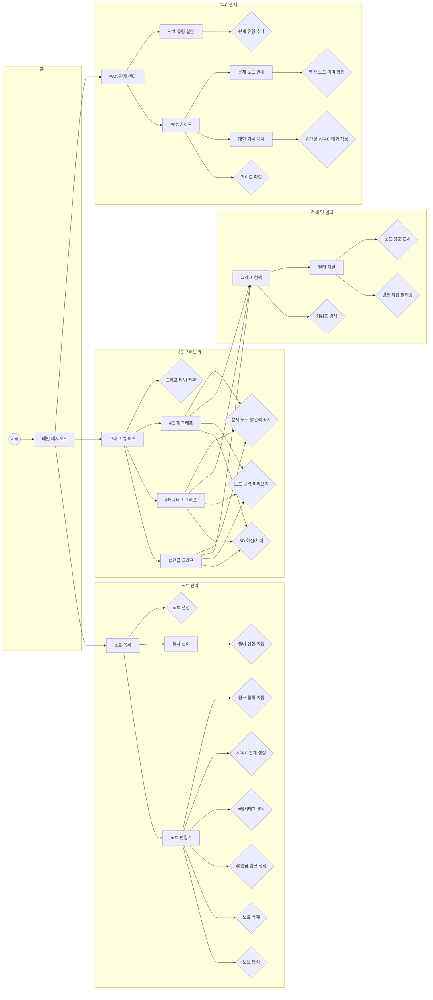

```mermaid
flowchart LR

  subgraph s1 ["홈"]
    n1(("시작"))
    n2["메인 대시보드"]
  end

  subgraph s2 ["노트 관리"]
    n3["노트 목록"]
    n4["노트 편집기"]
    n5["폴더 관리"]
    n6{"노트 생성"}
    n7{"노트 편집"}
    n8{"노트 삭제"}
    n9{"@언급 링크 생성"}
    n10{"#해시태그 생성"}
    n11{"&PAC 관계 생성"}
    n12{"링크 클릭 이동"}
    n13{"폴더 생성/이동"}
  end

  subgraph s3 ["3D 그래프 뷰"]
    n14["그래프 뷰 허브"]
    n15["@언급 그래프"]
    n16["#해시태그 그래프"]
    n17["&관계 그래프"]
    n18{"3D 회전/확대"}
    n19{"노드 클릭 미리보기"}
    n20{"그래프 타입 전환"}
    n35{"문제 노드 빨간색 표시"}
  end

  subgraph s4 ["검색 및 필터"]
    n21["그래프 검색"]
    n22["필터 패널"]
    n23{"키워드 검색"}
    n24{"링크 타입 필터링"}
    n25{"노드 강조 표시"}
  end

  subgraph s5 ["PAC 관계"]
    n26["PAC 관계 센터"]
    n27["PAC 가이드"]
    n28["관계 유형 설정"]
    n29{"가이드 확인"}
    n30{"관계 유형 추가"}
    n31["대화 기록 예시"]
    n32{"@대상 &PAC 대화 작성"}
    n33["문제 노드 안내"]
    n34{"빨간 노드 의미 확인"}
  end

  n1 --> n2
  n2 --> n3
  n2 --> n14
  n2 --> n26
  n3 --> n4
  n3 --> n5
  n3 --> n6
  n4 --> n7
  n4 --> n8
  n4 --> n9
  n4 --> n10
  n4 --> n11
  n4 --> n12
  n5 --> n13
  n14 --> n15
  n14 --> n16
  n14 --> n17
  n14 --> n20
  n15 --> n18
  n15 --> n19
  n15 --> n21
  n16 --> n18
  n16 --> n19
  n16 --> n21
  n17 --> n18
  n17 --> n19
  n17 --> n21
  n21 --> n23
  n21 --> n22
  n22 --> n24
  n22 --> n25
  n26 --> n27
  n26 --> n28
  n27 --> n29
  n28 --> n30
  n27 --> n31
  n31 --> n32
  n27 --> n33
  n33 --> n34
  n15 --> n35
  n16 --> n35
  n17 --> n35
```
